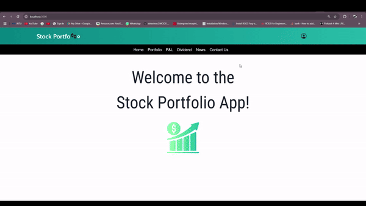

# Stock Tracker

A simple and user-friendly management interface to keep track of trades and portfolio performance

---

## Table of Contents

1. [Getting Started](#getting-started)
2. [Authors](#authors)

---

## Getting Started

1. Clone the git repository
2. Create an free account to get API_Keys: 
    - [Alpha Vantage](https://www.alphavantage.co/)
    - [FMP](https://site.financialmodelingprep.com/developer/docs)
3. Create an .env file and store the api keys

### Prerequisites
- Node.js (>= 18.x)
- npm (>= 8.x) 

### Installing Dependencies

Run the following command to install project dependencies:

```bash
cd <file_directory>
npm install
```

### To run the project

Run the following command to install project dependencies:

```bash
npm run start
```


### Demo


## Authors
1. [Lina](https://github.com/toddlerCoder007)
2. [Chow](https://github.com/ChowNUSISS)
3. [Yi Chen](https://github.com/yeyehandsome1984)